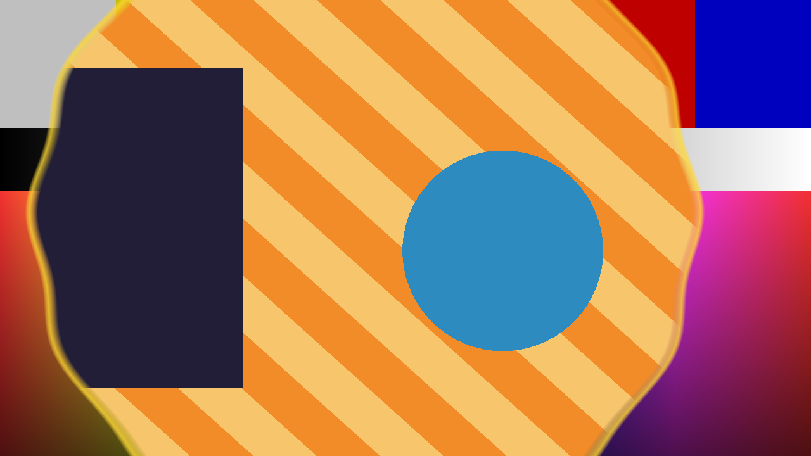

# Wipe

> **AI-assisted project.** This codebase was created with [Claude](https://claude.com/claude-code)
> (Anthropic), directed and reviewed by a human author. The pattern generator is
> not asserted but measured: an offline harness drives the real plugin class in
> a headless GL context with **two** input textures at two different
> resolutions and checks each claim against a closed form — a hard edge landing
> on its column **bitwise**, a soft edge's position integrated to **0.0000 px**,
> every pattern's B area within **0.33 px** of the fader in Area law, a circle's
> soft edge widening towards its centre **exactly as the parabola predicts**
> (41.855 px measured, 41.855 predicted), the modulator's sine recovered to
> **16.0000 px** of 16 (see [Status](#status)). It has **never been loaded into
> Resolume**, on any platform — not once. It is the fleet's second FFGL
> *mixer*, and several things about how a host treats one are still guesses.
> Check it in your own rig before trusting it in a show.

A 1970s vision mixer's analogue pattern generator, as an FFGL **mixer** for
[Resolume](https://resolume.com) Arena and Avenue.



<sub>The repo's two test cards through the plugin — a circle at Position 0.42
with a soft edge, a gold border and the modulator on — rendered by `wptest`,
the offline harness, not captured from Resolume.</sub>

## Every wipe is a waveform and a comparator

A vision mixer of that era did not store its wipes as pictures. It made them
live, from a few **analogue waveform generators** running at line and field
rate: a horizontal ramp, a vertical ramp, and horizontal and vertical
parabolas. It combined those in a small matrix — adding them, or taking the
larger with a non-additive mix, NAM — and compared the result against the
fader's level. Where the waveform was below the level you saw B; above it, A.

So every pattern in the menu is a formula in those two ramps, H and V:

| Pattern | Waveform |
| --- | --- |
| Horizontal, Vertical | H, or V |
| Box | NAM(\|H\|, \|V\|) |
| Diamond | \|H\| + \|V\| |
| Circle | H² + V² — the two parabolas, added |
| Clock | the angle, the one wipe that needed an arctangent generator |
| Matrix | a per-cell threshold order |

**What falls out of that**, rather than being added on:

- **Softness is the comparator's gain.** A low-gain comparator is a soft edge
  whose width is set by the waveform's slope — so a circle's edge is softer
  near its middle than at its rim, because the parabola is flatter there. The
  harness measures it: at Softness 16 px the circle's 10–90% width is 41.9 px
  at a radius of 82 px and 14.3 px at 233, and both are the closed form.
- **The border is a second comparator** a little above the level, and its
  width varies around the pattern for the same reason.
- **Modulation is a sine added to the waveform**, which wobbles the edge
  exactly as the modulator on a real generator did.
- **A circle is an ellipse** unless the generator compensates for the picture's
  aspect, as real ones had to. `Aspect Comp` off reproduces the ellipse, and the
  harness asserts its axes.
- The **positioner** moves where the waveforms cross zero. **Multiple** runs
  them at N times the line rate.

**It is a mixer, not an effect.** It needs a layer below it: that layer is A,
and the clip on this layer is B, which the fader wipes in.

## The controls

**Pattern** — Pattern, Reverse, Flip-Flop (reverse on alternate transitions:
A box-wipes in, then B box-wipes in), Aspect Comp.

**Fader** — Position, and Law. *Edge* is what the hardware did: the level is
linear in the fader. *Area* chooses the level so that the B area is exactly
the fader, solved in closed form for every pattern.

**Edge** — Softness, Border Width, Border Softness, all in pixels on the
horizontal ramp (every other pattern's width follows its slope from there),
and the Border colour as a swatch.

**Positioner** — Centre X, Centre Y, Rotation, Aspect. The positioner moves
the closed patterns and the clock; the ramps and the matrix ignore it, as the
hardware's did.

**Modulation** — Mod Amount (pixels), Mod Frequency (cycles across the
picture), Mod Speed, and Multiple H / Multiple V (1–8).

The spec's `Size` control is not here: in Edge law it would be the fader by
another name, and in Area law it cancels out exactly. See
[AGENTS.md](AGENTS.md).

## Build

Needs CMake and the Resolume FFGL SDK, which is a submodule.

```bash
git clone --recursive https://github.com/stoatworks-labs/wipe
cd wipe
cmake -B build -DCMAKE_BUILD_TYPE=Release
cmake --build build
cmake --install build    # → ~/Documents/Resolume Arena/Extra Effects
```

macOS builds universal (arm64 + x86_64) by default. Add
`-DCMAKE_OSX_ARCHITECTURES=arm64` for a faster development build.

The install path is **Extra Effects**, although this is a mixer. Resolume has one
FFGL folder, and sources, effects and mixers all load from it: genlock, the
fleet's first mixer, was loaded from there by Resolume Arena 7.27.1 and offered
as a layer Blend Mode. (Before v0.1.0 this said `Extra Mixers`, which Arena never
reads.)

## Building and testing

The harness renders the real plugin class headlessly, with **two** inputs —
`--input-a` is A, the layer below; `--input-b` is B, this layer — which may be
different sizes, with different hardware padding, rendered to a third size.

    ./build/wptest --out /tmp/frame.png     both cards, through the plugin
    ./build/wptest --list                   every parameter, kind and default
    ./build/wptest --mixer                  two inputs, two MaxUVs, and the guards
    ./build/wptest --ends                   Position 0 IS A and 1 IS B, every pattern
    ./build/wptest --edge                   the edge where Edge law puts it; circle vs ellipse
    ./build/wptest --area                   the B area where Area law puts it, every pattern
    ./build/wptest --softness               the edge width follows the waveform's slope
    ./build/wptest --border                 so does the border's
    ./build/wptest --modulation             the wobble is the stated sine, and it travels
    ./build/wptest --flipflop               alternate transitions reverse
    ./build/wptest --bench                  720p through 4K
    python3 tools/sweep.py                  no control is silently dead
    tools/verify.sh                         all of it, on a fresh universal build

Every check runs at **two rasters**, 640×360 and 320×180, and every tolerance
is derived from something physical — one pixel, one float ULP through the
comparator, the curvature of a parabola — rather than from the number this
machine printed first. Each check carries a **negative control**: something it
must be able to reject, run every time. [AGENTS.md](AGENTS.md) lists every
number and where it comes from.

## Status

**v0.1.0, unreleased, and honestly early.** Verified by measurement on an Apple
M4 Max, macOS 26.4.1, 2026-09-23, at 640×360 **and** 320×180 unless stated:

| Check | Result |
| --- | --- |
| Two inputs, two sizes, two MaxUVs | A 200×120 of 256×256, B 96×70 of 128×128, out 320×200: **0 padding pixels** reached the picture, every quadrant within **0.000 of 255**, the marker within one source texel |
| The missing-input guards | a null input array, zero inputs, one input, a null A and a null B all return `FF_FAIL` without crashing |
| The fader's ends | Position 0 is A and Position 1 is B, **bitwise, on all seven patterns**, with softness, border, modulation, multiple, positioner and rotation all on |
| Edge law, whole pixel | a hard edge at column p·W: B left, A right, **0 pixels wrong** at three columns |
| Edge law, fractional | a soft edge at 160.5, 320.25, 480.75 px recovered by integration to **0.0000 px** (tolerance 0.02) |
| Circle vs ellipse | Aspect Comp on: eight radii agree to **0.0007 px**; off: axes in the ratio **1.7778** of the picture's 1.7778, diagonal within 0.001 px of the ellipse |
| Area law | every pattern's B area within **0.33 px of area** of the fader (continuous, 4× supersampled); the corner-free patterns also within **0.68 px** summed over the displayed pixels |
| Softness | horizontal 10–90% width **12.8000 px** of 12.8; on the circle **41.855 / 23.449 / 14.318 px** at three radii, each the parabola's closed form to 0.001 |
| Border | **12 red columns** from column 320, contiguous; soft, the red integrates to **12.0000 px**; on the circle 31.801 and 14.938 px at two radii against 31.800 and 14.938 |
| Modulation | amplitude **16.0000 px** of 16, RMS residual from a sine **0.0000 px**, and a quarter second at 1 Hz moves the phase by exactly −π/2 |
| Flip-Flop | four transitions in a row alternate the box bitwise; the first arrival at an end counts for nothing |
| Mutation test | one character of the shipped GLSL (the comparator's 0.5 → 0.6) fails **five** checks; the circle built from \|H\|+\|V\| fails `--softness`; one MaxUV for both inputs fails `--mixer` |
| No dead controls | all **21** sweepable of the 25 parameters change the picture; the other four are the About buttons |
| macOS binary | universal (`x86_64 arm64`), exports `plugMain`, ad-hoc signs |
| Host metadata | `oxbow probe` reads **SW Wipe / WP01 / mixer / inputs 2..2** |
| Render cost | **0.03 ms/frame at 720p, 0.04 at 1080p, 0.12 at 4K** (0.7% of a 60 fps frame), worst of several runs. Area law adds a CPU solve on the frames where something changed: under 0.06 ms for any single pattern, **2.8 ms for a box at Multiple 8×8 and 7.8 ms for a circle** on a quiet machine (6.9 and 16.9 with other builds loading the CPU) |

Run `tools/verify.sh` before believing any of it.

**Not done, and the honest list is long.** It has **never been loaded into
Resolume** — not on macOS, not on Windows, not once — so every mixer-specific
claim about the *host* is a guess: that Resolume reads mixers from Extra
Mixers, whether it binds a parameter named `Opacity` to the layer's transition
(this plugin's fader is called `Position` and does not rely on it), whether it
calls a mixer with one input while the operator is patching, and whether it
drives a mixer's clock, which the modulator's travel depends on. The
**Windows build has never been compiled**; CI exists and has never run,
because there is no remote. Nothing has run on a **rasteriser other than this
Mac's**. The spec's `Size` control was dropped, for a stated reason. Area law
with both Multiples high is the one setting whose CPU cost is worth knowing
about. There are **no presets**, no OpenFX port, no browser demo and no user
guide — which is why the About block deliberately carries no guide link.
`StoatworksAbout.h` and `ATTRIBUTIONS.md` are provisional hand copies.

[AGENTS.md](AGENTS.md) has the full list of what is assumed rather than
measured, the open questions, and the traps.

## Licence

MIT — see [LICENSE](LICENSE) and [ATTRIBUTIONS.md](ATTRIBUTIONS.md).
