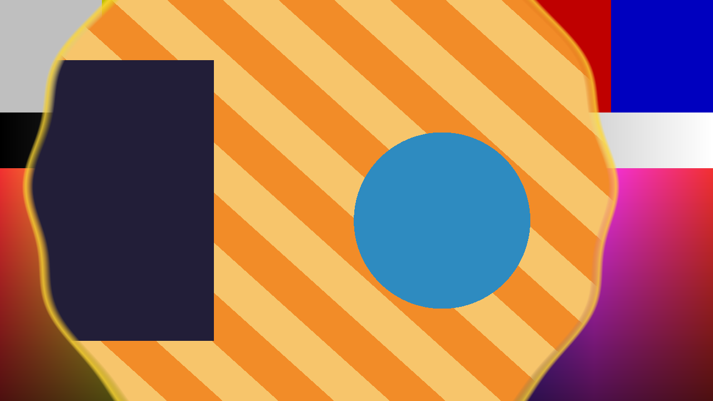
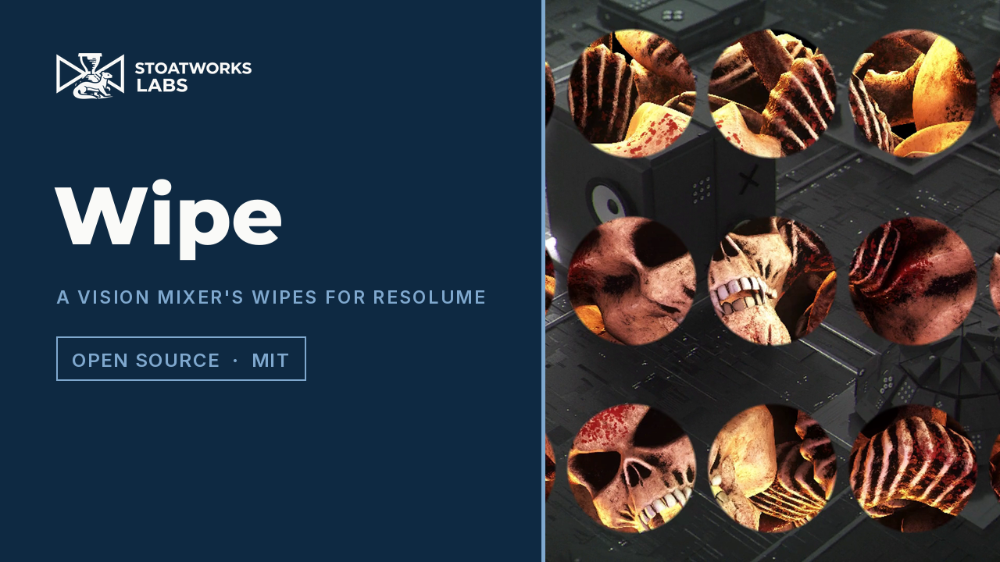

# Wipe

> **AI-assisted project.** This codebase was created with [Claude](https://claude.com/claude-code)
> (Anthropic), directed and reviewed by a human author. The pattern generator is
> not asserted but measured: an offline harness drives the real plugin class in
> a headless GL context with **two** input textures at two different
> resolutions and checks each claim against a closed form — a hard edge landing
> on its column **bitwise**, a soft edge's position integrated to **0.0000 px**,
> every pattern's B area within **0.33 px** of the fader in Area law, a circle's
> soft edge widening towards its centre **exactly as the parabola predicts**
> (41.855 px measured, 41.855 predicted), the modulator's sine recovered to
> **16.0000 px** of 16 (see [Status](#status)). It has **never been loaded into
> Resolume on macOS**. On Windows, a build of v0.1.0 loads in Resolume Arena
> 7.27.1, is offered as a layer's Blend Mode and is driven by the layer's opacity
> fader, on software rendering; no frame of its picture inside Resolume has been
> captured. It is the fleet's second FFGL *mixer*, built to what the first,
> genlock, measured in Arena. The OpenFX build — a **transition** — agrees with
> the FFGL plugin to **1/255** on 52 of 4,147,200 pixels and exactly everywhere
> else, rendered through a test host's Transition context. In **DaVinci Resolve
> 21.1** it works as an Edit-page transition (checked by the lead, 2026-10-03);
> it has not been tried in Vegas, Nuke or Natron. Check it in your own rig
> before trusting it in a show.

A 1970s vision mixer's analogue pattern generator, as an FFGL **mixer** for
[Resolume](https://resolume.com) Arena and Avenue — and as an OpenFX
**transition** for DaVinci Resolve, Vegas, Nuke and Natron.



<sub>The repo's two test cards through the plugin — a circle at Opacity 0.42
with a soft edge, a gold border and the modulator on — rendered by `wptest`,
the offline harness, not captured from Resolume.</sub>

<!-- downloads:start -->

## Download

**[v0.1.0](https://github.com/stoatworks-labs/wipe/releases/tag/v0.1.0)** — prebuilt for macOS and Windows. Pick your platform:

<details>
<summary><b>macOS</b> — Universal (Apple Silicon + Intel)</summary>

| Build | Download | Size |
| --- | --- | --- |
| Universal (Apple Silicon + Intel) · .dmg disk image | [`wipe-0.1.0-macos-universal.dmg`](https://github.com/stoatworks-labs/wipe/releases/download/v0.1.0/wipe-0.1.0-macos-universal.dmg) | 212 KB |
| Universal (Apple Silicon + Intel) · .zip archive | [`wipe-macos-universal.zip`](https://github.com/stoatworks-labs/wipe/releases/latest/download/wipe-macos-universal.zip) | 176 KB |

</details>

<details>
<summary><b>Windows</b> — x64</summary>

| Build | Download | Size |
| --- | --- | --- |
| x64 · .exe installer | [`wipe-0.1.0-windows-x86_64-setup.exe`](https://github.com/stoatworks-labs/wipe/releases/download/v0.1.0/wipe-0.1.0-windows-x86_64-setup.exe) | 222 KB |
| x64 · .zip archive | [`wipe-windows-x86_64.zip`](https://github.com/stoatworks-labs/wipe/releases/latest/download/wipe-windows-x86_64.zip) | 113 KB |

</details>

All builds, checksums and release notes: [github.com/stoatworks-labs/wipe/releases](https://github.com/stoatworks-labs/wipe/releases).

macOS builds are signed and notarised and open normally. The Windows builds are unsigned, so SmartScreen warns once.

<!-- downloads:end -->

## Every wipe is a waveform and a comparator

A vision mixer of that era did not store its wipes as pictures. It made them
live, from a few **analogue waveform generators** running at line and field
rate: a horizontal ramp, a vertical ramp, and horizontal and vertical
parabolas. It combined those in a small matrix — adding them, or taking the
larger with a non-additive mix, NAM — and compared the result against the
fader's level. Where the waveform was below the level you saw B; above it, A.

So every pattern in the menu is a formula in those two ramps, H and V:

| Pattern | Waveform |
| --- | --- |
| Horizontal, Vertical | H, or V |
| Box | NAM(\|H\|, \|V\|) |
| Diamond | \|H\| + \|V\| |
| Circle | H² + V² — the two parabolas, added |
| Clock | the angle, the one wipe that needed an arctangent generator |
| Matrix | a per-cell threshold order |

**What falls out of that**, rather than being added on:

- **Softness is the comparator's gain.** A low-gain comparator is a soft edge
  whose width is set by the waveform's slope — so a circle's edge is softer
  near its middle than at its rim, because the parabola is flatter there. The
  harness measures it: at Softness 16 px the circle's 10–90% width is 41.9 px
  at a radius of 82 px and 14.3 px at 233, and both are the closed form.
- **The border is a second comparator** a little above the level, and its
  width varies around the pattern for the same reason.
- **Modulation is a sine added to the waveform**, which wobbles the edge
  exactly as the modulator on a real generator did.
- **A circle is an ellipse** unless the generator compensates for the picture's
  aspect, as real ones had to. `Aspect Comp` off reproduces the ellipse, and the
  harness asserts its axes.
- The **positioner** moves where the waveforms cross zero. **Multiple** runs
  them at N times the line rate.

**It is a mixer, not an effect.** It needs a layer below it: that layer is A,
and the clip on this layer is B, which the fader wipes in. The
[user guide](docs/USER-GUIDE.md) covers installing it, picking it as a layer's
Blend Mode, and every control.

[](https://www.youtube.com/watch?v=HIclO2s5ylw)

*[Watch it](https://www.youtube.com/watch?v=HIclO2s5ylw) — 55 seconds:
a hard Horizontal wipe, Box and Diamond, a soft Circle whose edge is softer near its middle, a Clock with a border, a modulated edge, Multiple, and the positioner turning a box as it opens. Every frame is the real plugin's output: an FFGL plugin has no window,
so the footage is rendered by this repository's own offline harness
(`wptest --pipe`, driven by a cue sheet) rather than filmed off a screen, and
the clips are Resolume's bundled demo media.*

**[Try it in your browser](https://wipe-demo.stoatworks-labs.com)** — the
plugin's own wipe shader ported to WebGL2, with its pattern frame and both
fader laws (the closed-form Area solve included) ported to JavaScript, wiping
between two generated clips with every control. It is a port and not the
plugin: read what
[the page itself says it does not reproduce](https://wipe-demo.stoatworks-labs.com).

## The controls

**Pattern** — Aspect Comp, Pattern, Reverse, Flip-Flop (reverse on alternate
transitions: A box-wipes in, then B box-wipes in). Aspect Comp is first on
purpose: Resolume Arena does not show a mixer's first parameter (measured on
genlock, and confirmed on Wipe), so index 0 holds the one control whose
default — on, a round circle — is right if nobody can ever reach it.

**Fader** — Opacity, and Law. **Opacity is the fader**: 0 is A, the layer below,
and 1 is B, this layer. It is named Opacity on purpose, because Resolume binds a
mixer parameter of that name to the **layer's opacity fader** (measured on
genlock and on Wipe), so the layer's own fader drives the wipe and the Opacity
slider in the mixer's panel is overridden. *Edge* is what the hardware did: the level is
linear in the fader. *Area* chooses the level so that the B area is exactly
the fader, solved in closed form for every pattern.

**Edge** — Softness, Border Width, Border Softness, all in pixels on the
horizontal ramp (every other pattern's width follows its slope from there),
and the Border colour as a swatch.

**Positioner** — Centre X, Centre Y, Rotation, Aspect. The positioner moves
the closed patterns and the clock; the ramps and the matrix ignore it, as the
hardware's did.

**Modulation** — Mod Amount (pixels), Mod Frequency (cycles across the
picture), Mod Speed, and Multiple H / Multiple V (1–8).

The spec's `Size` control is not here: in Edge law it would be the fader by
another name, and in Area law it cancels out exactly. See
[AGENTS.md](AGENTS.md).

## OpenFX — Resolve, Vegas, Nuke, Natron

The same wipe also builds as an OpenFX plugin, **Wipe** in the **Stoatworks**
group, and there it is a **transition**: drop it between two clips in DaVinci
Resolve or Vegas and the host's transition drives it. It is the same pattern
generator — the same C++ for the frame, both fader laws and the parameter
conversions, and the wipe shader mirrored in C++ and tested against the GLSL
pixel for pixel — rendered on the CPU across every core.

The OpenFX zip for your platform (`wipe-ofx-macos-universal.zip`,
`wipe-ofx-windows-x86_64.zip` or `wipe-ofx-linux-x86_64.zip`, released from
v0.2.0 on) holds `Wipe.ofx.bundle`. Copy it into the standard OpenFX folder,
then restart the host:

```
macOS    /Library/OFX/Plugins/
Windows  C:\Program Files\Common Files\OFX\Plugins\
Linux    /usr/OFX/Plugins/
```

**The two inputs and the fader** map straight across:

| FFGL (Resolume) | OpenFX (Transition context) |
| --- | --- |
| A, the layer below — all of it at Opacity 0 | **SourceFrom**, the outgoing clip — all of it at Transition 0 |
| B, this layer — all of it at Opacity 1 | **SourceTo**, the incoming clip — all of it at Transition 1 |
| `Opacity`, the fader | **`Transition`**, which the host animates 0 → 1 |

So a Box opens on the incoming clip exactly as far at Transition 0.3 as it
opens on B at Opacity 0.3, and at exactly 0 and 1 the host is told to pass the
one clip through untouched. The plugin also declares OpenFX's **General**
context with the same two inputs, for hosts that have no transitions — Nuke,
Natron, Resolve's Fusion page — where you wire both inputs yourself and
keyframe `Transition` like any other control.

**What is different from the FFGL build**, and why:

- **No Flip-Flop.** In Resolume it remembers which end the fader last rested at
  and reverses every other wipe. That is memory of the previous transition,
  and an OpenFX transition is its own instance with no previous one; the host
  also renders frames alone, out of order and on several threads. **Reverse**
  is there, which is all Flip-Flop ever toggled. (It mirrors the pattern; a
  host's own reverse control, where there is one, runs the transition
  backwards instead.)
- **The modulator runs on the timeline.** Mod Speed's phase is the frame's
  time × the speed, so any frame renders on its own and scrubbing shows the
  wobble where playback would. In Resolume the phase runs from the first frame
  the mixer drew, the only clock a live mixer has. **Fusion reports no frame
  rate; there, Mod Speed assumes 24 fps.**
- **The Area law is solved every frame** rather than cached between frames;
  it costs under 0.1 ms for any single pattern, and about 7.5 ms for a Circle
  at Multiple 8 × 8.
- **The inputs are read pixel for pixel** in the host's coordinates, as OpenFX
  expects, where Resolume's mixer stretches each layer over the output. A host
  conforms both clips to the timeline first, and at the same size the two are
  the same reading.
- **Pixel sizes follow the render scale and the pixel aspect.** Softness,
  Border Width, Border Softness and Mod Amount are pixels of the full-size
  output, so a half-resolution proxy draws them half as wide; and Aspect Comp
  folds in the clip's pixel aspect, so a circle on an anamorphic format is
  round on the display.
- **The border colour is one colour control**, where FFGL declares Border Red,
  Green and Blue. **Aspect Comp is visible** — only Resolume hides a mixer's
  first parameter.
- Wipe has no audio path and no beat sync, so nothing else is missing.

**In DaVinci Resolve 21.1** (Studio, macOS; checked by the lead, 2026-10-03,
and again after the Fusion fix below) it works as an Edit-page transition: the
frames before it are exactly the outgoing clip and the frames after it exactly
the incoming one, and the progress is
linear — Resolve sends Transition ≈ (n + 0.5)/24 across a 24-frame transition,
never exactly 0 or 1. Its General context makes it a Fusion tool too, and
Fusion provides no frame rate at all; the first build failed to render there
for that reason, and this one falls back to 24 fps (checked under a test host
that reproduces Fusion's missing properties, not yet in Fusion itself). Not
tried in Vegas, Nuke or Natron. What else has been checked is in
[Status](#status).

## Build

Needs CMake and the Resolume FFGL SDK, which is a submodule.

```bash
git clone --recursive https://github.com/stoatworks-labs/wipe
cd wipe
cmake -B build -DCMAKE_BUILD_TYPE=Release
cmake --build build
cmake --install build    # → ~/Documents/Resolume Arena/Extra Effects
```

macOS builds universal (arm64 + x86_64) by default. Add
`-DCMAKE_OSX_ARCHITECTURES=arm64` for a faster development build.

The same build makes the OpenFX plugin, `build/Wipe.ofx.bundle` (turn it off
with `-DBUILD_OFX=OFF`). `-DWIPE_BUILD_FFGL=OFF` builds the OpenFX plugin alone
with nothing but a compiler — no FFGL SDK, no GLEW — which is how the Linux
build is made.

The install path is **Extra Effects**, although this is a mixer. Resolume has one
FFGL folder, and sources, effects and mixers all load from it: genlock, the
fleet's first mixer, was loaded from there by Resolume Arena 7.27.1 and offered
as a layer Blend Mode. (Before v0.1.0 this said `Extra Mixers`, which Arena never
reads.)

## Building and testing

The harness renders the real plugin class headlessly, with **two** inputs —
`--input-a` is A, the layer below; `--input-b` is B, this layer — which may be
different sizes, with different hardware padding, rendered to a third size.

    ./build/wptest --out /tmp/frame.png     both cards, through the plugin
    ./build/wptest --list                   every parameter, kind and default
    ./build/wptest --mixer                  two inputs, two MaxUVs, and the guards
    ./build/wptest --ends                   Opacity 0 IS A and 1 IS B, every pattern
    ./build/wptest --edge                   the edge where Edge law puts it; circle vs ellipse
    ./build/wptest --area                   the B area where Area law puts it, every pattern
    ./build/wptest --softness               the edge width follows the waveform's slope
    ./build/wptest --border                 so does the border's
    ./build/wptest --modulation             the wobble is the stated sine, and it travels
    ./build/wptest --flipflop               alternate transitions reverse
    ./build/wptest --cpu                    the OpenFX build's C++ shader against the GLSL, pixel for pixel
    ./build/wptest --cpu-bench              the OpenFX build's CPU render at 1080p
    ./build/wptest --bench                  720p through 4K
    ./build/wptest --pipe --pipe-src F      two raw RGBA streams in, frames out (filming, not a check)
    python3 tools/sweep.py                  no control is silently dead
    tools/verify.sh                         all of it, on a fresh universal build

Every check runs at **two rasters**, 640×360 and 320×180, and every tolerance
is derived from something physical — one pixel, one float ULP through the
comparator, the curvature of a parabola — rather than from the number this
machine printed first. Each check carries a **negative control**: something it
must be able to reject, run every time. [AGENTS.md](AGENTS.md) lists every
number and where it comes from.

## Status

**v0.2.0, and honestly early.** v0.2.0 adds the OpenFX build; the Resolume
build's output is unchanged. Verified by measurement on an Apple M4 Max, macOS
26.4.1, 2026-09-23 (the OpenFX rows 2026-10-03 and 04), at 640×360 **and**
320×180 unless stated:

| Check | Result |
| --- | --- |
| Two inputs, two sizes, two MaxUVs | A 200×120 of 256×256, B 96×70 of 128×128, out 320×200: **0 padding pixels** reached the picture, every quadrant within **0.000 of 255**, the marker within one source texel |
| The missing-input guards | a null input array, zero inputs, one input, a null A and a null B all return `FF_FAIL` without crashing |
| The fader's ends | Opacity 0 is A and Opacity 1 is B, **bitwise, on all seven patterns**, with softness, border, modulation, multiple, positioner and rotation all on |
| Edge law, whole pixel | a hard edge at column p·W: B left, A right, **0 pixels wrong** at three columns |
| Edge law, fractional | a soft edge at 160.5, 320.25, 480.75 px recovered by integration to **0.0000 px** (tolerance 0.02) |
| Circle vs ellipse | Aspect Comp on: eight radii agree to **0.0007 px**; off: axes in the ratio **1.7778** of the picture's 1.7778, diagonal within 0.001 px of the ellipse |
| Area law | every pattern's B area within **0.33 px of area** of the fader (continuous, 4× supersampled); the corner-free patterns also within **0.68 px** summed over the displayed pixels. Tolerance 1 px plus the GL spec's 1 part in 10^5 of the picture coordinate; on Apple's software renderer the worst is 1.50 px of 3.40 |
| Softness | horizontal 10–90% width **12.8000 px** of 12.8; on the circle **41.855 / 23.449 / 14.318 px** at three radii, each the parabola's closed form to 0.001 |
| Border | **12 red columns** from column 320, contiguous; soft, the red integrates to **12.0000 px**; on the circle 31.801 and 14.938 px at two radii against 31.800 and 14.938 |
| Modulation | amplitude **16.0000 px** of 16, RMS residual from a sine **0.0000 px**, and a quarter second at 1 Hz moves the phase by exactly −π/2 |
| Flip-Flop | four transitions in a row alternate the box bitwise; the first arrival at an end counts for nothing |
| Mutation test | one character of the shipped GLSL (the comparator's 0.5 → 0.6) fails **five** checks; the circle built from \|H\|+\|V\| fails `--softness`; one MaxUV for both inputs fails `--mixer` |
| No dead controls | all **21** sweepable of the 26 parameters change the picture; the other five are the About block |
| macOS binary | universal (`x86_64 arm64`), exports `plugMain`, ad-hoc signs |
| Host metadata | `oxbow probe` reads **SW Wipe / WP01 / mixer / inputs 2..2**, parameter 0 **Aspect Comp** |
| Render cost | **0.03 ms/frame at 720p, 0.04 at 1080p, 0.12 at 4K** (0.7% of a 60 fps frame), worst of several runs. Area law adds a CPU solve on the frames where something changed: under 0.06 ms for any single pattern, **2.8 ms for a box at Multiple 8×8 and 7.8 ms for a circle** on a quiet machine (6.9 and 16.9 with other builds loading the CPU) |
| OpenFX: the C++ shader against the GLSL | `wptest --cpu`, eight settings covering every pattern, both laws, soft edge, border, positioner, rotation, aspect, Aspect Comp, Reverse, both Multiples and the modulator, six fader positions each, two rasters — 13,824,000 pixels: **65 differ by 1/255, none by more**, worst float difference 1.8e-5. On Apple's software renderer, which CI gets, it passes too, with every disagreement inside the GL spec's allowance for the picture coordinate or that renderer's own measured `sin` (1.1e-3 off). Negative controls: the CPU's edge moved one pixel fails **exactly one column**; one character changed in the C++ copy fails the four soft-edge settings |
| OpenFX through a Transition host | `Wipe.ofx` in a test host's Transition context against the FFGL plugin's GPU render, same cards, 8-bit: 18 renders across eight settings — **52 of 4,147,200 pixels differ, worst 1/255**; the same in float depth. Transition 0 and 1 are the two clips **bitwise**, rendered or passed through by isIdentity. A Box against the FFGL Circle (the control) differs on 68,212 px |
| OpenFX without a frame rate | Resolve's Fusion page reports none, and the first build failed to render there (the lead, Resolve 21.1). Under a test host that removes it the same way (`--quirks fusion`): the first build fails with `kOfxStatErrMissingHostFeature` in the General and Transition contexts; this one renders, **byte-identical to a 24 fps render** and unlike a 25 fps one. Not yet re-run in Fusion itself |
| OpenFX determinism | frame 7 rendered alone, after frames 0–6, and after 20 and 3 in one instance: **byte-identical**; the 1 Hz modulator repeats every 25 frames at 25 fps |
| OpenFX render cost | **2.8 to 6.4 ms/frame at 1080p** on 8 threads (the test host's), 8-bit RGBA, median of nine; 7.8 ms for a Circle at Multiple 8×8 in Area law, which is the solve. One thread: 23 to 47 ms |
| OpenFX binary | universal (`x86_64 arm64`), exports `OfxGetPlugin`, plist names the binary on disk, ad-hoc signs; a host loads it as `com.stoatworks.wipe` with the Transition and General contexts |

Run `tools/verify.sh` before believing any of it.

**Windows, in Resolume Arena 7.27.1** (win-lab, Mesa llvmpipe, no GPU,
2026-09-23). The fleet's Arena gate cannot gate a mixer, so a CI build of this
source was probed by hand over Arena's REST API and the plugin's own log, as
genlock was. It loads from **Extra Effects**; Arena's log registers it as
`'SW Wipe' uid: WP01 category: 2` beside Resolume's own blend modes, and it is
offered in every layer's **Blend Mode** list. Set as layer 3's blend mode over a
still on layer 2, its log shows it initialised on Mesa llvmpipe (GL 4.5 Core),
loaded by Arena 7.27.1 build 15990 from Extra Effects, with no error line in
either log. Setting the **layer's** opacity to 0.3, 0.7 and 1.0 read back as the
mixer's `Opacity` 0.3, 0.7 and 1.0, and a write of 0.2 to the mixer's own
Opacity was overridden (it read back 1.0, the layer's): the layer's fader drives
the wipe, as designed. Writing Pattern = Circle over REST took. The mixer panel
shows **25 of the 26** declared parameters, and the one missing is **Aspect
Comp, index 0**: Arena hides a mixer's first parameter, as it hid genlock's, and
parking Aspect Comp there worked. No frame of the mixer's output was captured
(Arena's REST does not serve a mixer's picture), so a correct render inside
Resolume is not claimed.

**Not done, and the honest list is long.** Wipe has **never been loaded into
Resolume on macOS**, and its picture has not been looked at inside Resolume on
either platform. That Arena hands a mixer both inputs **padded** and calls
`SetTime` **every frame, in milliseconds** (so the modulator will travel) was
measured on genlock and not re-checked on Wipe. Whether a layer transition or
the autopilot moves `Opacity`, and whether Arena ever calls a mixer with one
input, are still open. CI runs on GitHub and is green: the Windows DLL compiles with MSVC,
and on the GPU-less macOS runner all nine suites and the control sweep pass on
Apple's software renderer. `--area` failed there at first — the software
renderer interpolates picture coordinates only to the GL spec's 1 part in
10^5, which is 2.3 px of area on a 640×360 vertical wipe, and the check had
allowed one pixel. The check was wrong, not the plugin; its tolerance now
includes that allowance, and `tools/verify.sh` runs every suite on the same
software renderer locally. Nothing has run on a **GPU other than this
Mac's**. The spec's `Size` control was dropped, for a stated reason.
Area law with both Multiples high is the one setting whose CPU cost is worth
knowing about. There are **no presets**. The OpenFX build has been in **one
real host**, DaVinci Resolve 21.1 on macOS, as an Edit-page transition, where
the clip order and the progress are right (checked by the lead, and again
after the Fusion fix); the Fusion fix is so far checked only against a test
host that reproduces Fusion's missing frame rate, and Vegas, Nuke and Natron are untried. Its Windows and
Linux builds are compiled and (Linux) load-tested on Rocky 8 in CI, and have
not rendered a frame. The
[browser demo](https://wipe-demo.stoatworks-labs.com) is a port, not the plugin.
The [user guide](docs/USER-GUIDE.md) covers every control, and the About
block's fourth button opens it.

[AGENTS.md](AGENTS.md) has the full list of what is assumed rather than
measured, the open questions, and the traps.

<!-- attributions:start -->
This project is built on other people's work — see [ATTRIBUTIONS.md](ATTRIBUTIONS.md).
<!-- attributions:end -->

## Licence

MIT — see [LICENSE](LICENSE).
